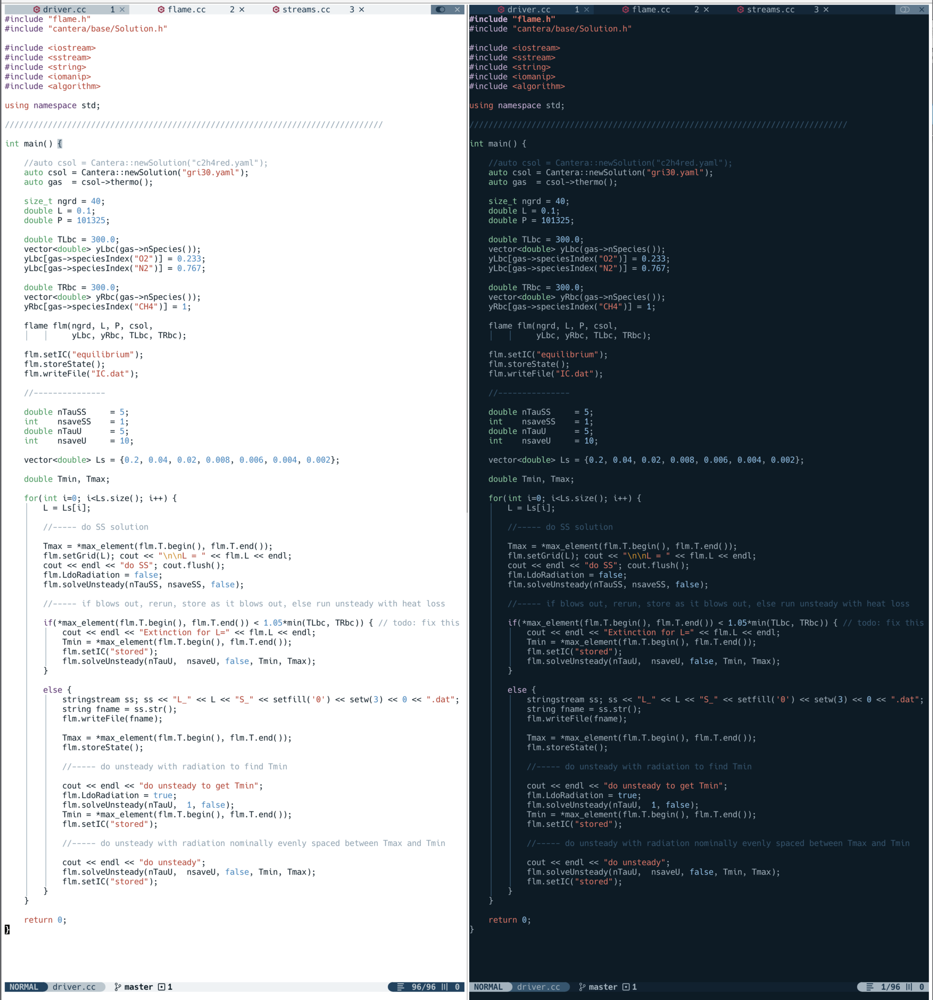

# NVChad custom directory

## Installation

Install [NvChad](https://nvchad.com/docs/quickstart/install)
* choose not to install the example config, that is what we are doing here.

Clone this repo into ```~/.config/nvim/lua/``` then rename: ```mv nvchad_custom custom```

## Added features and changes
* Plugins
    * markdown preview
    * LaTeX
    * Tmux navigation
    * maximize windows
    * open/close terminal
* User defined snippets
* Autocommands for text files (wrapping)
* Two new themes: forsake (dark), and repent (light) 
* Customized statusline and tabline
    * turn on buffer numbers
* Mappings


